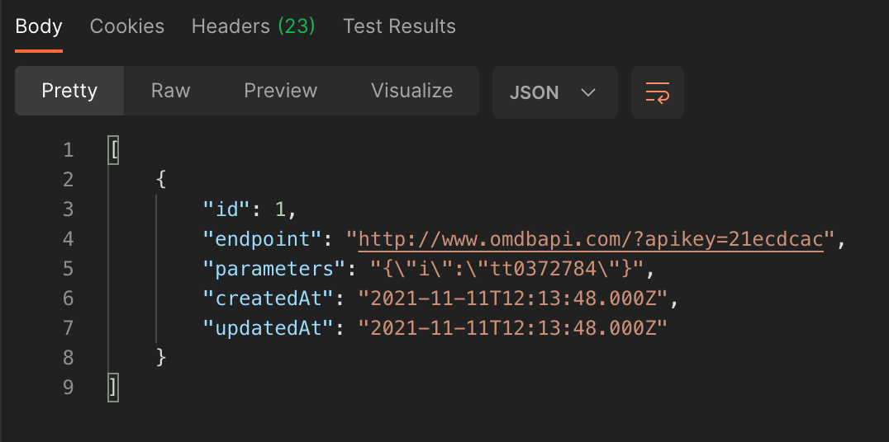
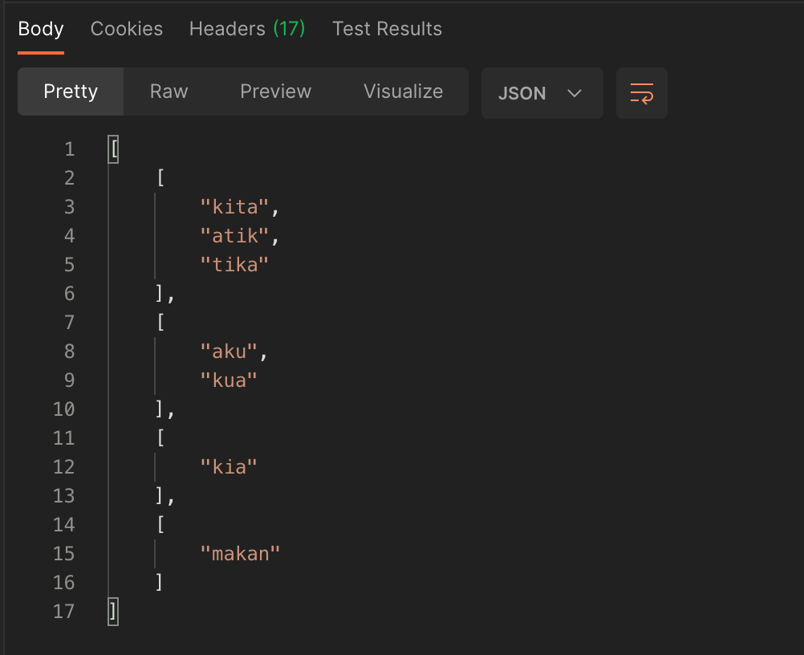

# Node Js Express Js MySql (Sequelize) | Tech Stack

## Requirements for install (I'm using NVM)

#### 1. NODE v12.22.6 AND NPM 6.14.15

#### 2. MySql 5.7.28

<br/>

## How to install

#### 1. Git clone this repo

#### 2. Open the project and then

```
npm install
```

#### 3. Copy .env.example or rename it into .env

#### 4. Create database with name codetest (if you want to use another database, define it in .env file with variable name is DB_DATABASE)

#### 5. Run Sequelize migrations to create SearchLogs table

```
npx sequelize-cli db:migrate
```

#### 6. Run the app (http://localhost:3001)

```
npm run dev
```

<br/>

## TEST RESULT

<br />

### :tada:  1. Simple Database Querying


#### Simply run this query on MySql Editor (I'm using MySql Online editor on https://onecompiler.com/mysql)

```
-- create
CREATE TABLE USERS (
  id INTEGER PRIMARY KEY,
  username TEXT NOT NULL,
  parent INTEGER
);

-- insert
INSERT INTO USERS VALUES (1, 'Ali', 2);
INSERT INTO USERS VALUES (2, 'Budi', 0);
INSERT INTO USERS VALUES (3, 'Cecep', 1);

-- fetch
SELECT u.id AS ID, u.username AS USERNAME, un.username AS PARENTUSERNAME FROM USERS AS u LEFT JOIN USERS AS un ON u.parent = un.id;
```

<b>RESULT</b>
| ID | USERNAME | PARENTUSERNAME |
| :-: | :------: | :------------: |
| 1 | Ali | Budi |
| 2 | Budi | |
| 3 | Cecep | Ali |

<br />

### :tada:  2. Please write a small ExpressJS server to search movies from http://www.omdbapi.com/

<b>Result</b>
<br />
Simply access this link:

- By Params => https://codetest.alfiansyah-ichsan.dev/api/v1/search?s=Batman&p=1

```
[
    {
        "Title": "Batman Begins",
        "Year": "2005",
        "imdbID": "tt0372784",
        "Type": "movie",
        "Poster": "https://m.media-amazon.com/images/M/MV5BOTY4YjI2N2MtYmFlMC00ZjcyLTg3YjEtMDQyM2ZjYzQ5YWFkXkEyXkFqcGdeQXVyMTQxNzMzNDI@._V1_SX300.jpg"
    },
    {
        "Title": "Batman v Superman: Dawn of Justice",
        "Year": "2016",
        "imdbID": "tt2975590",
        "Type": "movie",
        "Poster": "https://m.media-amazon.com/images/M/MV5BYThjYzcyYzItNTVjNy00NDk0LTgwMWQtYjMwNmNlNWJhMzMyXkEyXkFqcGdeQXVyMTQxNzMzNDI@._V1_SX300.jpg"
    },
    {
        "Title": "Batman",
        "Year": "1989",
        "imdbID": "tt0096895",
        "Type": "movie",
        "Poster": "https://m.media-amazon.com/images/M/MV5BMTYwNjAyODIyMF5BMl5BanBnXkFtZTYwNDMwMDk2._V1_SX300.jpg"
    },
    {
        "Title": "Batman Returns",
        "Year": "1992",
        "imdbID": "tt0103776",
        "Type": "movie",
        "Poster": "https://m.media-amazon.com/images/M/MV5BOGZmYzVkMmItM2NiOS00MDI3LWI4ZWQtMTg0YWZkODRkMmViXkEyXkFqcGdeQXVyODY0NzcxNw@@._V1_SX300.jpg"
    },
    {
        "Title": "Batman Forever",
        "Year": "1995",
        "imdbID": "tt0112462",
        "Type": "movie",
        "Poster": "https://m.media-amazon.com/images/M/MV5BNDdjYmFiYWEtYzBhZS00YTZkLWFlODgtY2I5MDE0NzZmMDljXkEyXkFqcGdeQXVyMTMxODk2OTU@._V1_SX300.jpg"
    },
    {
        "Title": "Batman & Robin",
        "Year": "1997",
        "imdbID": "tt0118688",
        "Type": "movie",
        "Poster": "https://m.media-amazon.com/images/M/MV5BMGQ5YTM1NmMtYmIxYy00N2VmLWJhZTYtN2EwYTY3MWFhOTczXkEyXkFqcGdeQXVyNTA2NTI0MTY@._V1_SX300.jpg"
    },
    {
        "Title": "The Lego Batman Movie",
        "Year": "2017",
        "imdbID": "tt4116284",
        "Type": "movie",
        "Poster": "https://m.media-amazon.com/images/M/MV5BMTcyNTEyOTY0M15BMl5BanBnXkFtZTgwOTAyNzU3MDI@._V1_SX300.jpg"
    },
    {
        "Title": "Batman: The Animated Series",
        "Year": "1992–1995",
        "imdbID": "tt0103359",
        "Type": "series",
        "Poster": "https://m.media-amazon.com/images/M/MV5BOTM3MTRkZjQtYjBkMy00YWE1LTkxOTQtNDQyNGY0YjYzNzAzXkEyXkFqcGdeQXVyOTgwMzk1MTA@._V1_SX300.jpg"
    },
    {
        "Title": "Batman: Under the Red Hood",
        "Year": "2010",
        "imdbID": "tt1569923",
        "Type": "movie",
        "Poster": "https://m.media-amazon.com/images/M/MV5BNmY4ZDZjY2UtOWFiYy00MjhjLThmMjctOTQ2NjYxZGRjYmNlL2ltYWdlL2ltYWdlXkEyXkFqcGdeQXVyNTAyODkwOQ@@._V1_SX300.jpg"
    },
    {
        "Title": "Batman: The Dark Knight Returns, Part 1",
        "Year": "2012",
        "imdbID": "tt2313197",
        "Type": "movie",
        "Poster": "https://m.media-amazon.com/images/M/MV5BMzIxMDkxNDM2M15BMl5BanBnXkFtZTcwMDA5ODY1OQ@@._V1_SX300.jpg"
    }
]
```

- Detail By ID => https://codetest.alfiansyah-ichsan.dev/api/v1/detail/tt0372784

```
{
    "Title": "Batman Begins",
    "Year": "2005",
    "Rated": "PG-13",
    "Released": "15 Jun 2005",
    "Runtime": "140 min",
    "Genre": "Action, Adventure",
    "Director": "Christopher Nolan",
    "Writer": "Bob Kane, David S. Goyer, Christopher Nolan",
    "Actors": "Christian Bale, Michael Caine, Ken Watanabe",
    "Plot": "After training with his mentor, Batman begins his fight to free crime-ridden Gotham City from corruption.",
    "Language": "English, Mandarin",
    "Country": "United Kingdom, United States",
    "Awards": "Nominated for 1 Oscar. 13 wins & 79 nominations total",
    "Poster": "https://m.media-amazon.com/images/M/MV5BOTY4YjI2N2MtYmFlMC00ZjcyLTg3YjEtMDQyM2ZjYzQ5YWFkXkEyXkFqcGdeQXVyMTQxNzMzNDI@._V1_SX300.jpg",
    "Ratings": [
        {
            "Source": "Internet Movie Database",
            "Value": "8.2/10"
        },
        {
            "Source": "Rotten Tomatoes",
            "Value": "84%"
        },
        {
            "Source": "Metacritic",
            "Value": "70/100"
        }
    ],
    "Metascore": "70",
    "imdbRating": "8.2",
    "imdbVotes": "1,362,365",
    "imdbID": "tt0372784",
    "Type": "movie",
    "DVD": "18 Oct 2005",
    "BoxOffice": "$206,852,432",
    "Production": "N/A",
    "Website": "N/A",
    "Response": "True"
}
```

- Search Logs https://codetest.alfiansyah-ichsan.dev/api/v1/search-logs

For updated data better access the link above



  <br />

### :tada:  3. Refactor the code below

  ⋅Key : "21ecdcac"
  
  ⋅URL : http://www.omdbapi.com/

Simply access this link https://codetest.alfiansyah-ichsan.dev/api/v1/find-first-string?str=stock(bit) | change the value as you want
  

Refactored code
```
const { str } = req.query;

var result = str.substring(str.indexOf('(') + 1, str.indexOf(')'));

res.status(200).json(result);
```

<b>Expected result should be "bit"</b>

<br />

### :tada:  4. Logic Test (Anagram)

input = ['kita', 'atik', 'tika', 'aku', 'kia', 'makan', 'kua']

<b>Result</b>
Simply access this link https://codetest.alfiansyah-ichsan.dev/api/v1/anagram

```
// code
anagram(req, res) {
  var words = ['kita', 'atik', 'tika', 'aku', 'kia', 'makan', 'kua'];

  let result = [];
  // BASICALLY, COMPARE FIRST VALUE IN FIRST ARRAY
  // TO ANOTHER LOOP
  // INDEX I COMPARE TO INDEX JSON.LENGTH
  for (let i = 0; i < words.length; i++) {
    for (let i = 0; i < words.length; i++) {
      let check = true;

      for (let j = 0; j < result.length; j++) {
        if (result[j].includes(words[i])) {
          check = false;
        }
      }

      if (check) {
        let anagrams = [];
        anagrams.push(words[i]);
        for (let j = 0; j < words.length; j++) {
          if (i !== j) {
            // COMPARE 2 VALUE
            // IF MATCH THEN PUSH TO ARRAY
            const word1 = words[i].split('').sort().join().trim();
            const word2 = words[j].split('').sort().join().trim();
            if (word1 === word2) {
              anagrams.push(words[j]);
            }
          }
        }

        // ANAGRAMS RESULT PUSH TO RESULT
        result.push(anagrams);
      }
    }
  }

  res.status(200).json(result);
},
```


